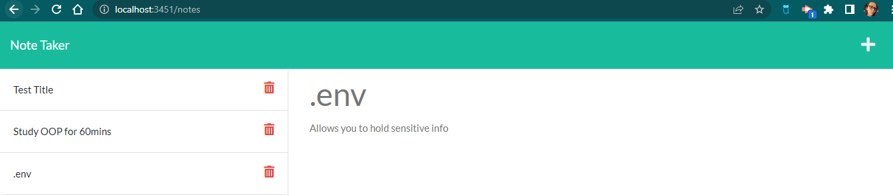
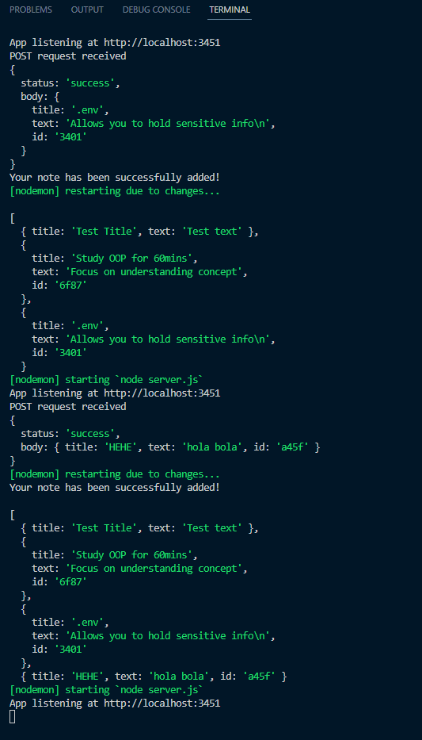
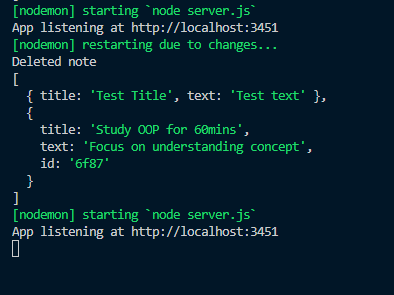
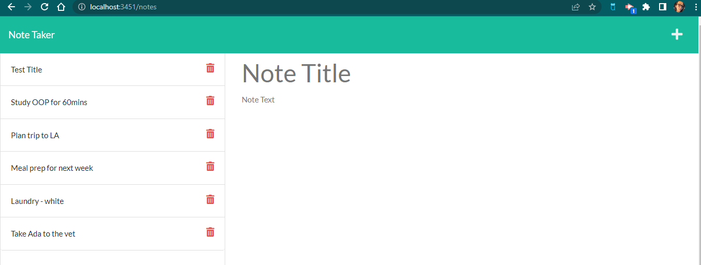

# Note-Taker

The note-taker application can be used to write, save, and delete notes as necessary. This could be a powerful tool to help users stay organized and on track of those tasks we easily forget when they are not written down somewhere.

## Technologies

The application was created using HTML, CSS, JavaScript, and Node.js (specifically Express). On the server-side, a JSON database is utilized to keep track of new inputs and deleted notes.

## Installation

To install, run nodemon server.js in the command line. Then, an http://localhost URL will be displayed on the terminal. Copy and paste it on the your browser of choice to access the application.

## Questions

If you would like to see more of my work, checkout my GitHub repositories under the user name Catalina Cueto.
If you have any additional questions, please contact me directly at: catacueto@gmail.com

